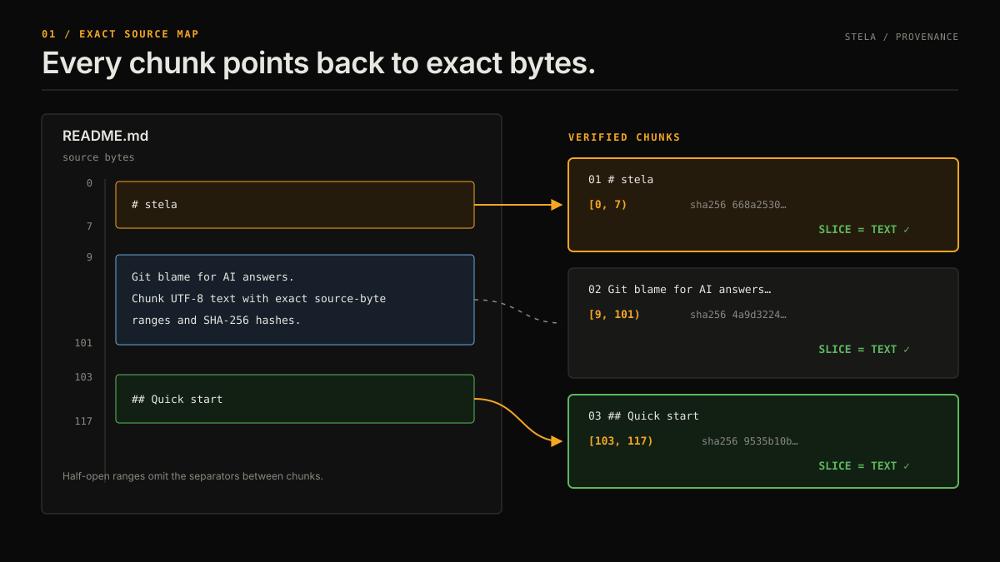

# stela

Git blame for AI answers. Chunk UTF-8 text with exact source-byte ranges and SHA-256 hashes.



## Quick start

Requires Node.js 22 or later.

```bash
npx @watthem/stela README.md
npx @watthem/stela report.txt --strategy heading --json
npx @watthem/stela report.txt --strategy word --max-words 256 --stats
```

Inputs must be valid UTF-8 text. Malformed encodings, UTF-16, NUL-containing binary inputs, and recognized PDF/ZIP containers are rejected. PDF/DOCX extraction is not supported. Extract text first; resulting ranges refer to that text artifact, not positions in the original PDF/DOCX.

## Provenance contract

Each `source.byteStart` / `source.byteEnd` is a zero-based, half-open byte range `[start, end)`. Line endings and Unicode are not normalized. Chunks are verbatim slices; surrounding whitespace and paragraph separators may be omitted, so concatenating chunks is not a lossless document reconstruction.

The pipeline checks bounds, ordering, equality with the source-byte slice, and SHA-256 before emitting each chunk. A failed check throws; `hashVerified: true` means the chunk matched the supplied bytes. This does not prove that a generated claim is supported, authenticate the source's author, or detect future edits to an external file.

For `Buffer` input, ranges refer to the supplied bytes. For string input, they refer to the string's UTF-8 encoding; `file` is a source label and the library does not read it. Ill-formed JavaScript strings containing unpaired surrogates are rejected. Keep the source artifact/version alongside its chunks for later verification.

## CLI

```text
stela <UTF-8-text-file> [options]

--strategy <heading|paragraph|sentence|word>  Default: paragraph
--max-words <n>                              Positive integer; word strategy only
--no-validate                                Skip quality checks; still verify bytes
--json                                       JSON array (default: NDJSON)
--stats                                      Pipeline stats to stderr
--help, -h                                   Show help
```

`word` counts whitespace-delimited words. It does **not** enforce an LLM/embedding token budget; one unbroken identifier can be arbitrarily long. Use your model's tokenizer to impose such a budget. Legacy `token`, `--max-tokens`, `maxTokens`, and `splitByToken` remain deprecated word-count aliases; the CLI warns when they are used. Prefer `word`, `--max-words`, `maxWords`, and `splitByWord`.

- Paragraph splitting recognizes LF, CRLF, CR, and space/tab-only blank lines.
- Heading splitting recognizes ATX (`#`) headings and legal section headings (ARTICLE, Section, Exhibit, Schedule, RECITALS, PREAMBLE, WHEREAS) outside backtick and tilde fences. It is not a full Markdown parser: Setext headings and container-specific list/blockquote nesting are not supported.
- Sentence splitting uses the runtime's English `Intl.Segmenter`, with common title abbreviations retained. It handles closing quotes and CJK sentence punctuation, but language/domain-specific abbreviations can still be ambiguous. Exact sentence boundaries can vary with the Node/ICU version; pin the runtime for reproducibility.

## Library

```bash
npm install @watthem/stela
```

<!-- executable-library-example -->
```javascript
import { run } from '@watthem/stela';

const documentText = 'First paragraph.\n\nSecond paragraph.';
const result = run(documentText, {
  strategy: 'paragraph',
  file: 'source.txt',
});

for (const chunk of result.chunks) {
  console.log(chunk.text);
  console.log(chunk.source.contentHash);
  console.log(chunk.source.byteStart, chunk.source.byteEnd);
  console.log(chunk.assessment.verdict);
}
```

For exact disk-file provenance, pass `readFileSync(path)` as a Buffer instead of decoding it yourself. `splitByHeading`, `splitByParagraph`, `splitBySentence`, and `splitByWord` return text-only arrays. They do not perform provenance verification; use `run` for verified chunks.

## Documentation

- [How stela works](docs/how-it-works.md)
- [The provenance contract](docs/provenance-contract.md)
- [CLI reference](docs/cli-reference.md)
- [Library API](docs/library-api.md)
- [When to use stela instead of another tool](docs/why-stela.md)
- [LangChain integration](docs/integrations/langchain.md)
- [LlamaIndex integration](docs/integrations/llamaindex.md)

## Quality assessments and migration

Quality scores are heuristics, **not calibrated probabilities**. They examine punctuation, bracket type/order, and simple text characteristics; they cannot establish factual accuracy or semantic completeness. `pass`, `flag`, and `reject` are quality classifications. All emitted chunks have independently verified byte provenance.

With `validate: false` / `--no-validate`, `validation.status` and `assessment.verdict` are `skipped`. Quality booleans and scores are `null`; hash verification still runs. Each chunk owns its nested metadata, so consumer annotations do not affect other chunks or calls.

Changes from 0.1.1 that consumers must handle:

- Add `skipped` to verdict handling and treat nullable quality values explicitly.
- `stats.skipped` counts unchecked chunks; `meanConfidence` excludes them and is `null` if none were assessed (including empty input).
- `validation.status` distinguishes `checked` from `skipped`.
- Invalid inputs/options now throw rather than silently producing output.
- Segmentation and heuristic verdicts changed for the corrected boundary cases.

## Development

```bash
npm ci
npm run typecheck
npm test
```

Tests include independent source-Buffer slice/hash checks, a seeded Unicode corpus, CLI error cases, and the executable library example above. Historic throughput measurements under `bench/` predate these correctness changes and should not be treated as current performance claims.

## License

MIT. See [LICENSE](LICENSE).
