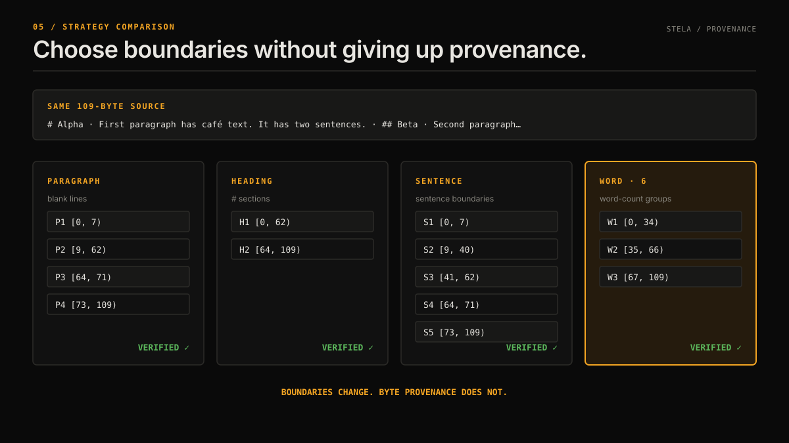

# CLI reference

## Usage

```text
stela <UTF-8-text-file> [options]

--strategy <heading|paragraph|sentence|word>  Default: paragraph
--max-words <n>                              Positive integer; word strategy only
--no-validate                                Skip quality checks; still verify bytes
--json                                       JSON array (default: NDJSON)
--stats                                      Pipeline stats to stderr
--help, -h                                   Show help
```

The examples below use this file:

```markdown
# Alpha

First paragraph has café text. It has two sentences.

## Beta

Second paragraph closes the example.
```

Offsets and hashes shown below come from the current CLI. UUIDs are omitted because they are generated on every run.

## Output formats

The default is newline-delimited JSON (NDJSON), one compact object per chunk:

```bash
npx @watthem/stela example.md
```

```json
{"index":1,"text":"First paragraph has café text. It has two sentences.","source":{"file":"example.md","byteStart":9,"byteEnd":62,"contentHash":"3c8be60d3ed3537d5857f30e36e53758052f54a0028729f40729d246be13a749","strategy":"paragraph"},"validation":{"status":"checked","boundaryClean":true,"complete":true,"warnings":[]},"assessment":{"verdict":"pass","confidence":{"score":1,"boundaryScore":1,"completenessScore":1,"hashVerified":true},"reasons":["clean"]}}
```

Use `--json` for one pretty-printed JSON array. Both formats contain the same chunk objects.



## Strategies

### `paragraph`

This is the default. It splits on one or more blank lines, including LF, CRLF, CR, and space- or tab-only blank lines.

```bash
npx @watthem/stela example.md --strategy paragraph
```

The example produces four chunks with ranges `[0, 7)`, `[9, 62)`, `[64, 71)`, and `[73, 109)`.

### `heading`

Splits before ATX headings (`#` through `######`) and common legal headings such as `ARTICLE`, `Section`, `Exhibit`, `Schedule`, `Recitals`, `Preamble`, and `Whereas`. Markdown headings inside backtick or tilde fences do not split the document. Setext headings are not supported.

```bash
npx @watthem/stela example.md --strategy heading
```

```json
{"index":0,"text":"# Alpha\n\nFirst paragraph has café text. It has two sentences.","source":{"byteStart":0,"byteEnd":62,"strategy":"heading","heading":"Alpha","headingLevel":1}}
{"index":1,"text":"## Beta\n\nSecond paragraph closes the example.","source":{"byteStart":64,"byteEnd":109,"strategy":"heading","heading":"Beta","headingLevel":2}}
```

These excerpts omit fields unrelated to the boundary demonstration.

### `sentence`

Uses the Node runtime's English `Intl.Segmenter`. stela keeps common titles such as `Dr.` and `Ms.` with the following text and handles common closing quotes and CJK sentence punctuation. Exact boundaries can vary with the Node/ICU version, so pin Node when segmentation must be reproducible.

```bash
npx @watthem/stela example.md --strategy sentence
```

The two sentences in the first paragraph have ranges `[9, 40)` and `[41, 62)`.

### `word`

Splits after a fixed count of whitespace-delimited words.

```bash
npx @watthem/stela example.md --strategy word --max-words 6
```

```json
{"index":0,"text":"# Alpha\n\nFirst paragraph has café","source":{"byteStart":0,"byteEnd":34,"strategy":"word"},"assessment":{"verdict":"flag","reasons":["mid_sentence_boundary"]}}
```

`--max-words` is not a model-token budget. One long identifier still counts as one word. Use your model's tokenizer if an embedding or context window imposes a hard token limit.

`--strategy token` and `--max-tokens` remain deprecated aliases that count words. The CLI prints a warning; new code should use `word` and `--max-words`.

## Quality validation

`--no-validate` disables boundary and completeness heuristics. It does not disable provenance verification.

```bash
npx @watthem/stela example.md --no-validate
```

```json
{"validation":{"status":"skipped","boundaryClean":null,"complete":null,"warnings":[]},"assessment":{"verdict":"skipped","confidence":{"score":null,"boundaryScore":null,"completenessScore":null,"hashVerified":true},"reasons":["validation_skipped"]}}
```

## Stats

`--stats` writes a summary to standard error so standard output remains available for chunk data:

```bash
npx @watthem/stela example.md --stats > chunks.ndjson
```

```json
{
  "totalChunks": 4,
  "passed": 4,
  "flagged": 0,
  "rejected": 0,
  "skipped": 0,
  "meanConfidence": 0.97,
  "processingMs": 3.7
}
```

`processingMs` varies by machine and run. `meanConfidence` excludes skipped chunks and is `null` if no chunks were assessed.

## Errors

The CLI writes concise errors to standard error, exits with status 1, and emits no chunk output. Common messages include:

| Message | Meaning |
|---|---|
| `provide exactly one UTF-8 text file` | The command received zero or multiple file paths. |
| `unknown strategy: ...` | The strategy is not supported. |
| `word limit must be a positive safe integer` | The word limit is zero, negative, fractional, nonnumeric, or too large. |
| `word limit requires --strategy word` | A word limit was used with another strategy. |
| `unsupported document format; extract UTF-8 text first` | The path has a PDF, DOC, DOCX, or ZIP extension. |
| `source must be valid UTF-8; unsupported or malformed encoding` | The file bytes are not valid UTF-8. |
| `binary document input is unsupported; provide extracted UTF-8 text` | The input has a PDF/ZIP signature or contains a NUL byte. |

Unknown flags and missing option values are also rejected.

