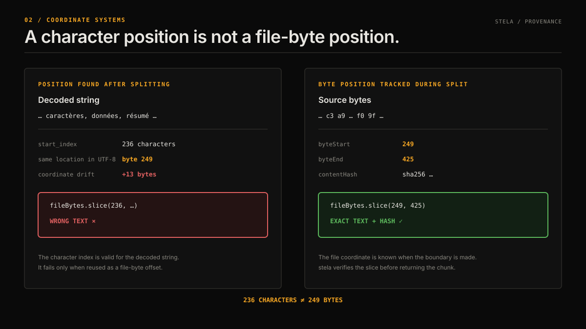

# When to use stela instead of another tool

stela is narrow: it chunks UTF-8 text and verifies the byte origin of every chunk. It is usually a complement to loaders, token-aware chunkers, embedding models, and vector stores rather than a replacement for them.



## LangChain text splitters

LangChain offers more splitter types and configuration options. Its `add_start_index` metadata is a character position found after splitting. That works for many sequential documents, but character indices are not UTF-8 byte offsets, and token-based splitters have documented cases where the lookup returns `-1`.

In the repository's reproducible comparison, LangChain 1.1.2 returned correct Python character offsets for a French document. Treating those numbers as file-byte offsets drifted by 13 bytes at the second chunk and 24 bytes by the third. stela's ranges sliced the file bytes correctly for every chunk. Duplicate paragraphs also received distinct ranges even when their hashes matched.

Use LangChain when you need its loaders, overlap controls, or configurable and token-aware splitters. Add stela before storage when you need a checked UTF-8 byte range and content hash. See the [experiment results](experiments/langchain-comparison/results.md), the [integration guide](integrations/langchain.md), and LangChain's documented [`TokenTextSplitter` start-index issue](https://github.com/langchain-ai/langchain/issues/29884).

## Chonkie

Chonkie provides a broader ingestion and chunking toolkit, including token-, sentence-, semantic-, and code-aware chunkers. Its documented chunk objects include start and end indices, and its fast chunker is optimized around byte-sized chunks. The public docs do not describe the same fail-closed source-slice plus SHA-256 contract that `run()` provides.

Use Chonkie when tokenizer budgets, semantic boundaries, code structure, or ingestion breadth drive the choice. Use stela when exact provenance is the primary contract. If you combine them, verify the integration with real source files before assuming one tool's positions have the other tool's byte semantics. No Chonkie/stela comparison experiment exists in this repository yet. See Chonkie's [Token Chunker](https://docs.chonkie.ai/python-sdk/chunkers/token-chunker) and [Fast Chunker](https://docs.chonkie.ai/oss/chunkers/fast-chunker) documentation.

## Unstructured

Unstructured partitions PDFs and other document formats into typed elements, then can combine those elements into chunks. stela does not parse PDF or DOCX files. The tools solve different stages of the pipeline.

A typical combination is:

```text
PDF or DOCX -> Unstructured partitioning -> saved UTF-8 text artifact -> stela -> embeddings
```

The stela ranges address the saved text artifact, not coordinates in the original PDF. Preserve Unstructured's page and element metadata separately if you also need page-level citations. See Unstructured's [chunking strategy documentation](https://docs.unstructured.io/api-reference/partition/chunking).

## Building the provenance layer yourself

The core algorithm is small, but the contract reaches beyond calling `indexOf()`:

- JavaScript string positions and UTF-8 byte positions diverge for accents, CJK text, emoji, and surrogate pairs.
- CRLF and other line endings must remain unchanged if offsets address the original file.
- repeated text needs occurrence-specific positions;
- malformed encodings and binary containers must fail before lossy decoding; and
- every output needs an independent slice and hash check.

Build it yourself if your input format or chunking rules require a different contract. stela is useful when its current strategies fit and you would otherwise need to write and test those edge cases again.

